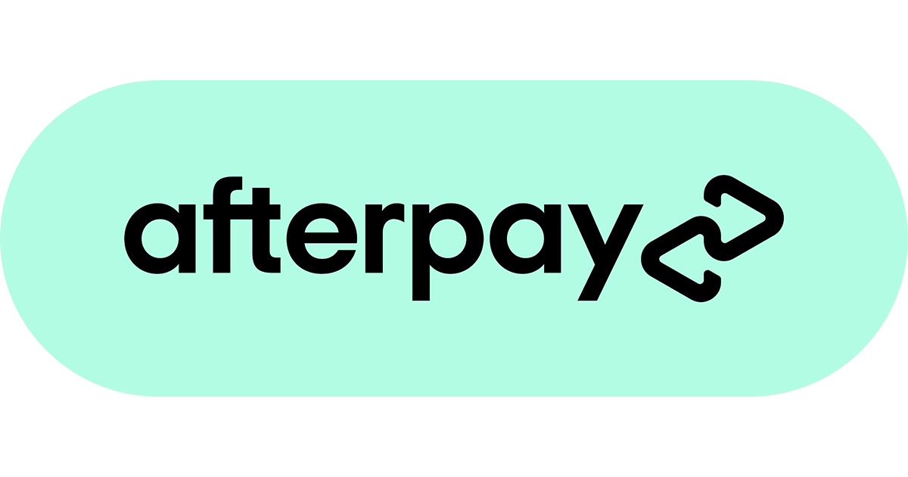

# FinTech_Case_study
# **AFTERPAY**

---
## **Overview and Origin** 
---
The origins of the company reivented the spending habits of millions of millenials.Co-founder and Co-CEO Anthony Eisen and Nick Molnar commenced their journey with the idea of selling excess stock of jewellery on Ebay which led to the largest Australian jewellery retailer [Financial review](https://www.afr.com/companies/financial-services/why-fashion-is-key-to-afterpay-s-staggering-success-20210211-p571jp#:~:text=Perhaps%20you%20already%20know%20the,highest%2Dselling%20Australian%20jewellery%20retailer.). Afterwards, consumer spending  habits shifted paradigm from traditional services to an advanced methodology as consumers were affted by the financial crisis in 2008. The company launched in the year 2014 with initial stages of funding expected to be $35.4m. To date the company has had a successful run during 2020 as they gained substatial market share as consumers shifted to a credit based purchase.

---
## **Business Activities** 
---

The company operates in the Buy Now Pay Later (BNPL) segment of the market which has been one of the topics of the century involving cutting edge payment gateway processing systems. The core business driver are customers aiming to make a purchase immediately with the ability to pay in instalments throughout a span of 4 fortnightly payments. The focus was to enable consumers to attain immediate satisfaction of products/services with the option of providing credit. Consumer spending habits have evolved throughout years with numerous options hence, spending habits tend to be relatively on the rise. The company has integrated with one of the largest e-commerce giants ebay to offer payments to any products purchased on the site. This strategy has disrupted making payments upfront enabling the customer to have more purchasing power at a point in time. 

APT's largest customer base are in the region of ANZ however, they exapnded to US and Uk. Q1 FY21 customer base 11.2 million up from 5.7 million Q1FY20 (September 2019) [consumer base](https://www.savings.com.au/buy-now-pay-later/afterpay-doubles-number-of-users-since-2019). During the Covid-19 pandemic the company disclosed adding 20,500 users per day during March-June. Afterpay aims itself squarely at millennials. The first-half 2018 financials claim people aged between 18 to 34 make up 67% of Afterpay's customer base [2018 status](https://www.choice.com.au/shopping/online-shopping/buying-online/articles/what-is-afterpay).

The platform seeks to attract millenials and youth as no credit checks nor proof of income is verified. The youth will take advantage of this opportunity to utilize tha platform optimally as their fashion trends and wants are substantial between the ages of 18-24. The company has nearly 38,000 SME merchants and expanding to enable a range of services for the customer base. 

---

## **Landscape** 
---

Recently its growth strategy was to repay over a span of 8 weeks. Furthermore, in recent few month they launched a new card that is available to pay directly to suppliers.
The industry reached its peak during 2020 as consumers shifted from paying upfront to a credit based system providing an immediate satisfaction of the product/service. Comapnies such as Zip Pay Co., Klarna and OpenPay offered similar services in this segment competing for market amongst retailers and e-commerce giants. Paypal an international company recently launched its credit platform in the US and concurrently expanding globally which might be the largest threat. 

Fintech companies in the payments space, such as Venmo (now owned by PayPal PYPL) target the millennial generation using innovative, technologically-driven offering and are able to trigger network effects, thus growing exponentially faster than their peers [technology](http://lumosbusiness.com/businessmodel-innovation-afterpay-touch/). Dovetail company started rebuilding the Web portal from scratch. This included a technology infrastructure refresh and new payments process, consumer-facing design and integration with the mobile app via APIs.

---
## **Conclusion and Recommendation** 
---
Afterpay generated $3.1 billion in total net benefits to the Australian
economy in 2020. [https://afterpay-corporate.yourcreative.com.au/wp-content/uploads/2021/04/afterpay-Economic-Impact-report-2020-Accenture.pdf]. Assisting SME's has been their new primary target to obtain larger market share supporting locally manufactured goods and services. The ability to reach customers in the ANZ region was the primary metric to assess performance. Reaching a large user base with the intent of making in app purchases and online sales have been the key drivers of performance. 

The industry significantly poses a looming threat of new competitors with low barriers to entry in BNPL segment. Such companies as Klarna have been depleting its market share as they rival against innovation and services. Klarna in fact had an extenive network that had 7x more users, 200,000 merchants in 17 countries .( https://seekingalpha.com/article/4396452-afterpay-competition-threatens-global-expansion). In an effort to combat rivals Afterpay launched its own loyalty program that rewards it customers creating a unique selling point advantageous in battling rivals. 

Compettors in this landscape utilize multiple marketing strategies to entice customers. Gen Z consumers would be the pivot point as the next decade will boost relative sales. Rewards and perks for the would enable customers to use the services more frequently as it is a one stop shop app that delivers all the requirements. The realm shifts paradigms instantly to compete with retailers and other companies. A lump sum capital would be required to cater to the promotional campaign to grasp customers enabling them the opportunity to join the loyalty and rewards program. Enabling a large customer base would minimize the commissions on the retailer hence, enabling them to offer greater discounts and drop sales for customers favourite brands and services. 
In addition, introducing a signature card for loyal customers would boost esteem loyal customers with the ability to utilize their own personal card to shop at stores. This could also enable users to utilize the blockchain network to pay for products/services. Shifting to blockchain would enable smarter transaction with minimal fees and transparency that could enable productivity escalating and workloads easing. 
